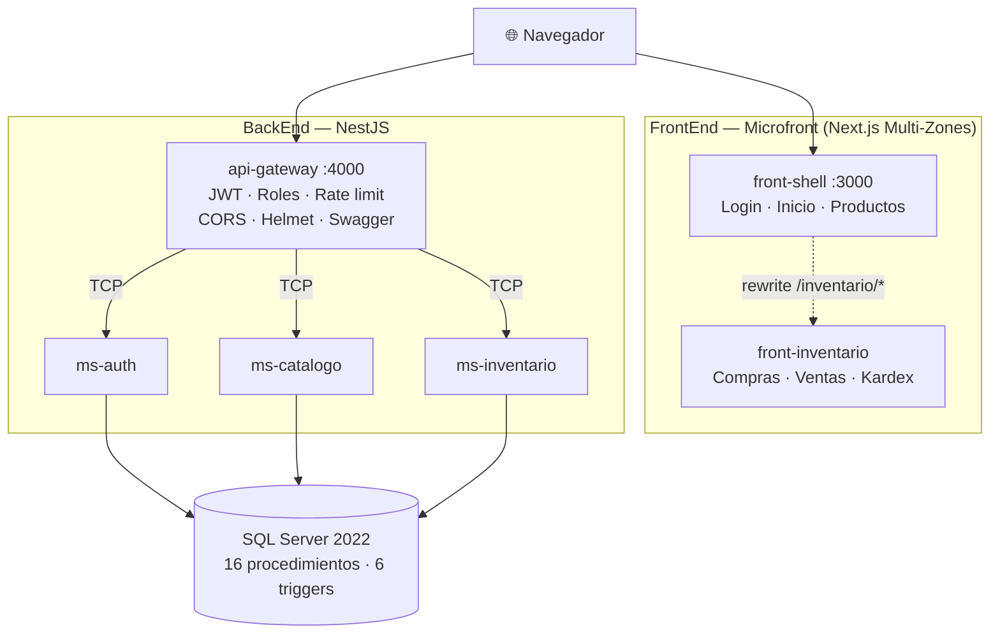

<div align="center">

# Sistema de Gestión de Insumos Médicos — HCE

**Control de medicamentos e insumos en atenciones clínicas: compras, ventas y trazabilidad por Kardex.**

Solución al examen técnico para _Especialista de Desarrollo TI — HCE_, Clínica San Felipe.

[](https://github.com/Braulio2002/examen-hce-clinica-san-felipe/actions/workflows/calidad.yml)
[](#verificación)
[](#verificación)

<br>


<br>

[Puesta en marcha](#puesta-en-marcha) ·
[Casos de uso](#casos-de-uso) ·
[Arquitectura](#arquitectura) ·
[Seguridad](#seguridad) ·
[Verificación](#verificación) ·
[Documentación](#documentación)

</div>

---

## Cumplimiento del enunciado

Cada requisito, y dónde está resuelto.

### BackEnd — sección 1.1

| Requisito                                              |     | Dónde                                                               |
| ------------------------------------------------------ | :-: | ------------------------------------------------------------------- |
| API REST con NestJS, dockerizada                       | ✅  | [`backend/`](backend/) · [`docker-compose.yml`](docker-compose.yml) |
| Arquitectura de microservicios                         | ✅  | 3 microservicios + API Gateway                                      |
| JWT con duración estricta de 30 min                    | ✅  | [`main.ts`](backend/apps/api-gateway/src/infraestructura/main.ts)   |
| Modelo relacional con las 7 tablas                     | ✅  | [`01-schema.sql`](database/01-schema.sql)                           |
| Los 8 servicios exigidos                               | ✅  | [Casos de uso](#casos-de-uso)                                       |
| Scripts de BD (insertar, listar, actualizar, eliminar) | ✅  | [`04-consultas-tsql.sql`](database/04-consultas-tsql.sql)           |
| Documentador REST (Swagger)                            | ✅  | `localhost:4000/api/docs`                                           |
| Colección para probar la API                           | ✅  | [`postman/`](postman/)                                              |
| CORS restringido al FrontEnd                           | ✅  | Lista blanca; el comodín se rechaza al arrancar                     |
| Patrones Facade y Decorator                            | ✅  | [Patrones de diseño](#patrones-de-diseño)                           |
| Principios SOLID                                       | ✅  | [Arquitectura](#arquitectura)                                       |

### FrontEnd — sección 1.2

| Requisito                                                   |     | Dónde                                                             |
| ----------------------------------------------------------- | :-: | ----------------------------------------------------------------- |
| Next.js con microfront                                      | ✅  | Multi-Zones: 2 zonas independientes                               |
| Interceptores para el token JWT                             | ✅  | [`cliente.ts`](frontend/paquetes/api-cliente/src/cliente.ts)      |
| **1.2.1** Compra con varios productos                       | ✅  | [Registrar compra](#1--registrar-compra)                          |
| **1.2.1** Modal para crear producto inexistente             | ✅  | `ModalNuevoProducto`                                              |
| **1.2.1** Actualiza costo y precio (× 1.35), genera Entrada | ✅  | `usp_Compra_Registrar`, en una transacción                        |
| **1.2.2** Venta mostrando precio y stock por producto       | ✅  | [Registrar venta](#2--registrar-venta)                            |
| **1.2.2** Bloqueo si la cantidad supera el stock            | ✅  | Cliente y servidor; probado bajo concurrencia                     |
| **1.2.2** Cálculo de subtotal, IGV y total al digitar       | ✅  | [Observación sobre el IGV](#observación-sobre-el-cálculo-del-igv) |
| **1.2.2** Genera movimiento de Salida                       | ✅  | `usp_Venta_Registrar`                                             |
| **1.2.3** Kardex con las 5 columnas exigidas                | ✅  | [Kardex](#3--kardex)                                              |
| **1.2.3** Botón por fila con modal de movimientos           | ✅  | Fecha, tipo y cantidad, más saldo acumulado                       |

### Consideraciones globales — sección 1.3

| Requisito                                          |     | Dónde                                                          |
| -------------------------------------------------- | :-: | -------------------------------------------------------------- |
| Maquetado con Tailwind CSS                         | ✅  | [`tailwind.config.ts`](frontend/apps/shell/tailwind.config.ts) |
| Diseño responsivo para tablets y laptops           | ✅  | Áreas táctiles de 44 px; tablas con desplazamiento propio      |
| Clean Architecture en NestJS **con justificación** | ✅  | [`docs/02-arquitectura.md`](docs/02-arquitectura.md)           |
| `docker-compose.yml` con Back, Front y BD          | ✅  | 7 contenedores                                                 |
| API Gateway en la capa NestJS                      | ✅  | Único servicio expuesto al exterior                            |
| Mínimo 2 mecanismos de seguridad                   | ✅  | **6 implementados** — [Seguridad](#seguridad)                  |
| Repositorio público con README                     | ✅  | Este documento                                                 |

---

## Puesta en marcha

Requisitos: **Docker Desktop** con Docker Compose v2. Nada más — no hace falta
Node ni SQL Server instalados en el equipo.

```bash
git clone https://github.com/Braulio2002/examen-hce-clinica-san-felipe.git
cd examen-hce-clinica-san-felipe
cp .env.example .env
docker compose up --build
```

La primera construcción descarga la imagen de SQL Server (~1.5 GB) y tarda
varios minutos. Las siguientes son casi instantáneas.

Cuando `api-gateway` aparezca como `healthy`, todo está listo:

| Recurso               | URL                                | Notas                               |
| --------------------- | ---------------------------------- | ----------------------------------- |
| **Aplicación web**    | http://localhost:3000              | Punto de entrada                    |
| **Swagger**           | http://localhost:4000/api/docs     | Documentación interactiva           |
| **API**               | http://localhost:4000/api/v1       | Base de todos los endpoints         |
| **Salud del Gateway** | http://localhost:4000/api/v1/salud | Usado por el healthcheck            |
| **SQL Server**        | `127.0.0.1,14330`                  | Usuario `sa`, contraseña del `.env` |

### Usuarios de demostración

| Usuario    | Contraseña     | Rol      | Permisos                    |
| ---------- | -------------- | -------- | --------------------------- |
| `admin`    | `Admin123$`    | ADMIN    | Acceso total                |
| `farmacia` | `Farmacia123$` | FARMACIA | Compras, ventas y productos |
| `consulta` | `Consulta123$` | CONSULTA | Solo lectura                |

La base arranca con 12 insumos médicos, dos compras y una venta ya registradas,
de modo que el Kardex tiene movimientos desde el primer minuto.

### Antes de un despliegue real

El `.env.example` trae contraseñas de muestra y un `JWT_SECRET` de marcador.
**Genere los suyos:**

```bash
openssl rand -base64 48
```

---

## Casos de uso

Los ocho servicios que exige la sección 1.1.1, con su endpoint, el procedimiento
que los resuelve y el rol mínimo necesario.

|  #  | Servicio                | Endpoint               | Procedimiento             | Rol      |
| :-: | ----------------------- | ---------------------- | ------------------------- | -------- |
|  1  | **Registrar Compra**    | `POST /compras`        | `usp_Compra_Registrar`    | FARMACIA |
|  2  | **Registrar Venta**     | `POST /ventas`         | `usp_Venta_Registrar`     | FARMACIA |
|  3  | **Registrar Producto**  | `POST /productos`      | `usp_Producto_Registrar`  | FARMACIA |
|  4  | **Actualizar Producto** | `PATCH /productos/:id` | `usp_Producto_Actualizar` | FARMACIA |
|  5  | **Listar Compra**       | `GET /compras`         | `usp_Compra_Listar`       | CONSULTA |
|  6  | **Listar Venta**        | `GET /ventas`          | `usp_Venta_Listar`        | CONSULTA |
|  7  | **Listar Producto**     | `GET /productos`       | `usp_Producto_Listar`     | CONSULTA |
|  8  | **Listar Kardex**       | `GET /kardex`          | `usp_Kardex_Listar`       | CONSULTA |

Cada uno es **una clase de caso de uso** en la capa de aplicación del
microservicio que le corresponde. Hay quince en total —los ocho del enunciado,
más los de detalle, autenticación y perfil— y el mayor ocupa 74 líneas.

```
ms-auth        iniciar-sesion · obtener-perfil
ms-catalogo    registrar-producto · actualizar-producto · listar-productos
               obtener-producto · eliminar-producto
ms-inventario  registrar-compra · listar-compras · obtener-compra
               registrar-venta · listar-ventas · obtener-venta
               listar-kardex · movimientos-producto
```

### 1 · Registrar compra

Permite cargar varias líneas y crear un producto desde un modal si no existe. El
selector admite búsqueda por texto: ignora mayúsculas y tildes, acepta palabras
sueltas en cualquier orden y también encuentra por número de lote.

Al confirmar, el servidor ejecuta **una sola transacción**:

1. Graba `CompraCab` y `CompraDet`.
2. Actualiza el costo del producto y recalcula su precio de venta
   (`PrecioVenta = Costo × 1.35`).
3. Genera el movimiento de tipo **Entrada** en el Kardex.

Si cualquier paso falla, no se graba nada. Que sea indivisible no es un lujo: si
el precio se actualizara después, existiría una ventana en la que una venta
concurrente cobraría el precio anterior.

### 2 · Registrar venta

Muestra por producto el precio de venta y el **stock disponible**, calculado
desde la tabla de movimientos. No permite guardar si alguna cantidad supera el
stock: la fila se marca, el campo indica el error y el botón queda deshabilitado
con el mensaje _«la cantidad no debe ser mayor al stock»_.

Esa validación es comodidad para el usuario. **La autoridad está en el
servidor**, que revalida dentro de la transacción y con bloqueo, de modo que dos
cajas vendiendo el mismo insumo a la vez no pueden provocar sobreventa.

### 3 · Kardex

Grilla con identificador, nombre, stock actual, costo y precio de venta. Cada
fila abre un modal con los movimientos del producto: fecha, tipo de movimiento,
cantidad y **saldo acumulado**.

La paginación se resuelve en el servidor con `OFFSET/FETCH` y una función de
ventana para el total: el navegador recibe solo la página que pidió.

---

## Arquitectura

### Vista de despliegue



Solo `front-shell` y `api-gateway` publican puerto. Los tres microservicios y la
base son alcanzables únicamente desde la red interna de Docker.

### Clean Architecture — las cuatro capas

Cada microservicio se organiza en cuatro capas, y las dependencias apuntan
**siempre hacia adentro**.

```
┌─────────────────────────────────────────────────────────────┐
│  4 · INFRAESTRUCTURA                                        │
│     main.ts · Módulos NestJS · Configuración                │
│  ┌───────────────────────────────────────────────────────┐  │
│  │  3 · ADAPTADORES                                      │  │
│  │     Controladores · Pasarelas · Mapeadores · DTOs     │  │
│  │  ┌─────────────────────────────────────────────────┐  │  │
│  │  │  2 · APLICACIÓN                                 │  │  │
│  │  │     Casos de uso · Puertos · Fachadas           │  │  │
│  │  │  ┌───────────────────────────────────────────┐  │  │  │
│  │  │  │  1 · DOMINIO                              │  │  │  │
│  │  │  │     Entidades · Objetos de valor          │  │  │  │
│  │  │  │     Excepciones de negocio                │  │  │  │
│  │  │  └───────────────────────────────────────────┘  │  │  │
│  │  └─────────────────────────────────────────────────┘  │  │
│  └───────────────────────────────────────────────────────┘  │
└─────────────────────────────────────────────────────────────┘

              Las flechas de import van  ←←←
```

| Capa                    | Qué contiene                                        | Qué **no** puede importar                                 |
| ----------------------- | --------------------------------------------------- | --------------------------------------------------------- |
| **1 · Dominio**         | Entidades, objetos de valor, excepciones de negocio | Nada externo. Ni NestJS, ni `mssql`, ni `class-validator` |
| **2 · Aplicación**      | Casos de uso, puertos, fachadas, modelos            | Frameworks. Tampoco decoradores                           |
| **3 · Adaptadores**     | Controladores, pasarelas, mapeadores, DTOs          | La raíz de composición que los construye                  |
| **4 · Infraestructura** | `main.ts`, módulos NestJS, configuración            | —                                                         |

**Esta regla no es una convención escrita: está verificada.** Dos pruebas
recorren el código fuente, analizan cada `import` y fallan si una capa mira
hacia afuera. Cuando se escribió la segunda, encontró una violación real que
llevaba tiempo sin detectarse.

> **La decisión que la sostiene:** los casos de uso **no llevan `@Injectable()`**.
> Son clases planas de TypeScript que reciben sus dependencias por constructor, y
> todo el cableado vive en un único archivo por servicio, con `useFactory`.
> Ponerles el decorador los ataría al contenedor de NestJS y la capa de
> aplicación pasaría a depender del framework.
>
> El beneficio es medible: las 122 pruebas del backend corren en segundos y sin
> base de datos.

### Patrones de diseño

| Patrón          | Dónde                                | Para qué                                                           |
| --------------- | ------------------------------------ | ------------------------------------------------------------------ |
| **Facade**      | `aplicacion/fachadas/`               | Agrupa los casos de uso tras una interfaz simple                   |
| **Decorator**   | `adaptadores/pasarelas/*-trazada.ts` | Añade medición de tiempos y reintentos sin tocar la clase original |
| **Repository**  | `aplicacion/puertos/salida/`         | Abstrae la persistencia del dominio                                |
| **Adapter**     | `adaptadores/pasarelas/`             | Implementa los puertos contra SQL Server, bcrypt o JWT             |
| **Mapper**      | `adaptadores/mapeadores/`            | Traduce filas de la base al modelo de aplicación                   |
| **API Gateway** | `apps/api-gateway/`                  | Punto único de entrada y de seguridad                              |
| **Multi-Zones** | `frontend/apps/`                     | Microfrontend con despliegue independiente                         |

> Conviene distinguir dos cosas que se llaman igual. El **patrón Decorator** de
> la GoF es un objeto que envuelve a otro con la misma interfaz. Los
> `@Decoradores` de NestJS son metadatos del lenguaje. El proyecto usa ambos.

### FrontEnd — microfront y organización

Dos aplicaciones Next independientes que se construyen y despliegan por
separado, compuestas en una sola URL. Dentro de cada zona el código se organiza
**por funcionalidad**, no por tipo de archivo.

```
frontend/
├── apps/shell/                  Zona anfitriona · única expuesta
│   └── src/
│       ├── app/                 Rutas: solo composición
│       ├── funcionalidades/     productos/
│       └── compartido/          api · navegación
├── apps/inventario/             Zona de inventario · basePath /inventario
│   └── src/
│       ├── app/                 Rutas: solo composición
│       ├── funcionalidades/     compras/ · ventas/ · kardex/
│       └── compartido/          api · useCatalogo · useLineasDocumento
└── paquetes/                    Lo que comparten AMBAS zonas
    ├── api-cliente/             Axios + interceptores + tipos
    └── ui/                      Sistema de diseño y chrome
```

La regla de ubicación es simple: lo que usan varias funcionalidades **de una
zona** va en el `compartido/` de esa zona; lo que usan **ambas zonas** va en
`paquetes/`, como dependencia declarada. Subir a `paquetes/` algo que solo
necesita una zona rompería el aislamiento del microfront.

### Base de datos

Toda la lógica transaccional vive en **16 procedimientos almacenados**. Ninguna
parte del código emite SQL directamente, lo que elimina la superficie de
inyección y hace posible el mínimo privilegio por servicio.

**El stock no se almacena.** Se deriva siempre de la tabla de movimientos, que es
la única fuente de verdad. Una columna `stock` sería un dato duplicado, y basta
que un proceso inserte un movimiento y olvide actualizar el contador para que la
cifra que ve farmacia sea falsa **sin que nada falle**.

El costo de derivarlo se paga con un índice de cobertura sobre
`MovimientoDet (Id_Producto) INCLUDE (Cantidad)`. Verificado con las vistas de
diagnóstico de SQL Server: tras ejecutar toda la suite, el motor **no echa en
falta ningún índice**.

---

## Seguridad

El enunciado pide un mínimo de dos mecanismos. Se implementaron **seis**.

| Mecanismo                  | Implementación                                                               |
| -------------------------- | ---------------------------------------------------------------------------- |
| **JWT de 30 minutos**      | HS256 con `issuer` y `audience` validados                                    |
| **Cookie HttpOnly**        | Inaccesible desde JavaScript; mitiga el robo de token por XSS                |
| **Rate limiting**          | 100 peticiones/min general, 5/min en login                                   |
| **CORS restringido**       | Lista blanca; el comodín `*` se rechaza al arrancar                          |
| **Cabeceras de seguridad** | Helmet, `nosniff`, CSP con nonce por petición, `X-Frame-Options: DENY`, HSTS |
| **Autorización por rol**   | Guard global con ADMIN / FARMACIA / CONSULTA                                 |

Y uno que el enunciado no pide: **mínimo privilegio en la base de datos**. Cada
microservicio tiene su propia cuenta, con permiso para ejecutar únicamente sus
procedimientos. **Ninguna tiene un solo permiso sobre tablas ni vistas** — no
hacen falta, gracias al encadenamiento de propiedad. Si `ms-catalogo` intentara
registrar una venta, el error no llega del código: llega de SQL Server.

Además: bcrypt para contraseñas, defensa contra enumeración de usuarios por
temporización, parámetros tipados en todo acceso a SQL, rechazo de campos no
declarados en los DTOs, contenedores sin privilegios de root y bitácora de
auditoría inmutable.

Las limitaciones conocidas están declaradas en el
[documento de arquitectura](docs/02-arquitectura.md).

---

## Verificación

**1 319 comprobaciones automáticas** repartidas en cinco suites.

| Suite                                              | Casos | Qué cubre                                                             |
| -------------------------------------------------- | :---: | --------------------------------------------------------------------- |
| [BackEnd](#pruebas-del-backend)                    |  757  | Dominio, casos de uso, adaptadores, seguridad y raíces de composición |
| [FrontEnd](#pruebas-del-frontend)                  |  497  | Cliente HTTP, componentes, hooks y pantallas                          |
| [Extremo a extremo](#pruebas-de-extremo-a-extremo) |  43   | El sistema completo en ejecución                                      |
| [Base de datos](#pruebas-de-base-de-datos)         |  13   | Reglas de negocio y aislamiento entre servicios                       |
| [Concurrencia](#prueba-de-concurrencia)            |   9   | El invariante de stock bajo competencia real                          |

### Puerta de calidad

```bash
cd backend  && npm run quality   # formato · tipos · lint · pruebas+cobertura · build
cd frontend && npm run quality   # formato · tipos · lint · pruebas · build
```

| Comprobación                                        | Backend                          | Frontend                                                |
| --------------------------------------------------- | -------------------------------- | ------------------------------------------------------- |
| `format:check` (Prettier)                           | limpio                           | limpio                                                  |
| `typecheck` (`strict` + `noUncheckedIndexedAccess`) | 0 errores                        | 0 errores                                               |
| `lint:strict` (0 avisos permitidos)                 | limpio                           | limpio                                                  |
| Pruebas                                             | 757 casos                        | 497 casos                                               |
| Cobertura                                           | **100 %** en las cuatro métricas | **100 %** sentencias, funciones y líneas · 99,8 % ramas |
| `npm audit`                                         | 0 vulnerabilidades               | 0 vulnerabilidades                                      |

La cobertura es **completa y exigida**, no solo alcanzada: los umbrales estan
declarados en `package.json` (Jest) y en `vitest.config.ts`, de modo que una
linea nueva sin prueba hace fallar `npm test` y con ello la integracion continua.

La unica excepcion es **una rama** del FrontEnd, en el atrapado de foco del
modal:

```ts
const primero = enfocables[0];
const ultimo = enfocables[enfocables.length - 1];
if (!primero || !ultimo) return;
```

Con `noUncheckedIndexedAccess` activado, TypeScript exige comprobar el resultado
de indexar un array. En ejecucion esa comprobacion no puede fallar: el contenedor
del dialogo siempre incluye su boton de cerrar, asi que la lista nunca esta
vacia. Cubrirla exigiria una asercion de no nulidad —que debilita los tipos y
que el linter estricto prohibe— o retorcer el componente para fabricar un caso
que no existe. El umbral refleja esa realidad (99,8 %) en lugar de disimularla.

Llegar al 100 % hizo aflorar codigo que **nunca podia ejecutarse**: tres guardas
que repetian, sobre el mismo estado y en el mismo instante, una condicion que la
interfaz ya impedia, y un respaldo `?? '-'` en la traza de conexion a la base
cuyos operandos siempre tienen valor. Se retiraron. Codigo inalcanzable no es
defensa en profundidad: es duplicacion que nadie puede verificar.

El linter no es el `next lint` por defecto: es `typescript-eslint` con reglas que
usan información de tipos, más **SonarJS**, **unicorn**, **eslint-plugin-security**,
**import-x** y, en el frontend, **jsx-a11y** y las reglas de React Hooks. Incluye
reglas de arquitectura propias que impiden por configuración lo que las pruebas
de dependencia verifican en ejecución.

Todo esto corre además en **GitHub Actions** en cada push, sobre un Ubuntu
limpio, junto con la construcción de las seis imágenes Docker.

### Pruebas del BackEnd

```bash
cd backend && npm test          # ejecuta la suite
cd backend && npm run test:cov  # con informe de cobertura y umbral
```

Cubren **todo el proyecto**, capa por capa, sin base de datos ni contenedores:

| Capa            | Qué se comprueba                                                                                                                     |
| --------------- | ------------------------------------------------------------------------------------------------------------------------------------ |
| Dominio         | El objeto de valor `Importe` con la fórmula del enunciado y el margen de 1.35, las entidades y sus invariantes                       |
| Aplicación      | Los 15 casos de uso y las fachadas, con dobles de los puertos de salida                                                              |
| Adaptadores     | Mapeadores, pasarelas de SQL Server, decoradores de trazado y reintento, controladores RPC y REST, guardias, filtros e interceptores |
| Infraestructura | Las **cuatro raíces de composición**, levantadas de verdad                                                                           |
| Arquitectura    | La regla de dependencia y la superficie del paquete compartido, símbolo a símbolo                                                    |

Dos de esas suites merecen mención aparte.

**Las raíces de composición.** Los casos de uso son clases planas sin
`@Injectable()`, así que todo el grafo se arma a mano con `useFactory`. Ese
cableado no lo comprueba el compilador: un `inject` en distinto orden que los
parámetros de la fábrica compila igual y entrega el repositorio donde iba el
registro. Las pruebas levantan cada módulo con el servicio de base sustituido y
verifican que cada pieza se construye, que la cadena de decoradores queda
apilada en el orden previsto y que la fachada recibe cada caso de uso en su
posición. En el gateway comprueban además el orden de los guardias globales, que
es el orden en que se ejecutan.

**La traducción de errores del motor.** Los procedimientos almacenados lanzan
códigos numéricos —51001, 54004, 2627— que el adaptador de persistencia
convierte en excepciones de dominio. Ese mapeo es el contrato entre la base y la
aplicación: sin él, un «no hay stock» llegaría al usuario como un error interno
del servidor. Hay una prueba por código.

### Pruebas de extremo a extremo

```bash
bash scripts/prueba-humo.sh
```

43 comprobaciones contra el sistema en ejecución: JWT de 30 minutos, cookie
HttpOnly, CORS, rate limiting, cabeceras de seguridad del API y del FrontEnd,
autorización por rol, cálculo de importes, actualización de precio por compra,
validación de stock, coherencia del Kardex y protección de rutas de la zona.

> El script es reejecutable sin re-provisionar la base: crea su producto de
> prueba con un lote único por ejecución y absorbe las esperas del rate limit
> que él mismo agota al verificarlo.
>
> Ese reintento tiene un coste que conviene conocer: durante un tiempo ocultó
> que la API entera estaba limitada a 5 peticiones por minuto. Por eso la
> comprobación 16b lanza su ráfaga con `curl` directo, sin pasar por el
> envoltorio. **Un reintento que absorbe el fallo que debería delatar es peor que
> no tener la prueba.**

### Prueba de concurrencia

```bash
bash scripts/prueba-concurrencia.sh
```

La prueba de humo verifica que no se pueda vender más de lo que hay, pero lo hace
en secuencia: una venta, contra un sistema en reposo. Ese es el caso fácil.

Este script provoca el difícil, el que ocurre en planta: **veinte cajas
despachando a la vez el último envase**. Si la comprobación de stock y el
descuento no fueran atómicos, todas leerían «queda 1», todas aprobarían, y el
inventario terminaría en negativo — sin error visible, y con el descuadre
apareciendo semanas después en un conteo físico.

Exige que exactamente una venta se acepte, que las otras diecinueve reciban 422,
que ninguna termine en error interno —un 500 significaría que el bloqueo se
resolvió por interbloqueo, es decir por accidente— y que el stock final sea 0,
nunca negativo.

Es lo que demuestra que `UPDLOCK, HOLDLOCK` en `usp_Venta_Registrar` sostiene el
invariante de verdad, en lugar de afirmarlo en un comentario.

> Con `VENTAS_PARALELAS=50` se puede subir la presión. El limitador se cruza en
> el camino: si alguna venta lo toca, el script lo detecta, avisa y no da un
> resultado engañoso.

### Pruebas del FrontEnd

```bash
cd frontend && npm test
cd frontend && npx vitest run --coverage
```

Se ejecutan en **jsdom**: los componentes se montan de verdad y se consultan por
rol y por texto accesible, no por clase CSS ni por estructura de nodos. La
diferencia no es de estilo. Una prueba que busca `.btn-primario` se rompe al
renombrar una clase aunque el botón siga funcionando, y no se entera si el botón
deja de ser accesible; consultando como lo haría una persona —o un lector de
pantalla— la prueba falla cuando cambia el comportamiento, que es cuando debe
fallar. **La accesibilidad queda cubierta sin proponérselo**: si un `aria-label`
desaparece, la consulta deja de encontrar el elemento.

| Suite         | Qué cubre                                                                                                                 |
| ------------- | ------------------------------------------------------------------------------------------------------------------------- |
| `api-cliente` | Interceptores, traducción de errores HTTP a mensajes presentables, reacción al 401 y contrato de cada servicio con la API |
| `ui`          | Botón, campo, modal, paginación, selector buscable, formulario de producto, navegación y proveedor de sesión              |
| Hooks         | Carga de catálogo y detalle de documento, con `renderHook`                                                                |
| Pantallas     | Productos, compras, ventas y Kardex, con la API sustituida y el resto de piezas reales                                    |

Tres comprobaciones concretas que valen más que su tamaño:

- **El modal devuelve el foco a quien lo abrió.** Es el criterio 2.4.3 de las
  WCAG y pesa más de lo habitual aquí: en planta el teclado suele ser el
  dispositivo principal, y sin esa devolución quien acaba de pulsar «Ver» en la
  fila 30 del Kardex tiene que recorrer la tabla entera otra vez. Se verifica
  abriendo, cerrando y mirando dónde quedó el foco.
- **La navegación distingue las dos zonas.** Con Multi-Zones, un enlace del
  shell hacia el inventario tiene que ser un `<a>` y no un `<Link>`: el enrutador
  del shell no conoce esas rutas y devolvería un 404. Ese fallo ocurrió durante
  el desarrollo; la prueba es lo que impide que vuelva.
- **La línea de venta no lleva precio.** Lo fija el servidor desde el catálogo.
  Está comprobado en el servicio, en la tabla y en la pantalla.

### Pruebas de base de datos

```bash
docker compose exec sqlserver /opt/mssql-tools18/bin/sqlcmd \
  -S localhost -U sa -P "$MSSQL_SA_PASSWORD" -C \
  -i /scripts/99-pruebas-verificacion.sql
```

Diez comprueban reglas de negocio —fórmula del IGV, precio de venta, bloqueo por
stock, auditoría inmutable— y tres verifican que cada microservicio solo alcanza
sus propios procedimientos.

### Colección de Postman

Importe `postman/HCE-Insumos.postman_collection.json` junto con
`postman/HCE-Local.postman_environment.json`. La petición de login guarda el
token automáticamente; el resto lo reutiliza.

---

## Trazabilidad entre microservicios

Una compra atraviesa cuatro procesos. Cada uno escribía en su propio registro, y
sin nada que los uniera, averiguar qué operación produjo qué error consistía en
comparar marcas de tiempo a ojo.

Cada petición lleva ahora un identificador que nace en el Gateway, viaja dentro
del mensaje RPC y aparece en las líneas de todos los servicios:

```bash
curl -i -H "Authorization: Bearer $TOKEN" http://localhost:4000/api/v1/kardex
# X-Request-Id: 0602272a-b4dd-49bf-8c72-a9d1fe0758b3

docker compose logs api-gateway ms-catalogo ms-inventario | grep 0602272a
```

```
hce-api-gateway   [Peticion]           [traza-165425] POST /api/v1/compras — 437 ms
hce-ms-catalogo   [ProductoPasarela]   [traza-165425] registrar(...) completado en 195.6 ms
hce-ms-inventario [InventarioPasarela] [traza-165425] registrarCompra(1 lineas) en 409.2 ms
hce-ms-inventario [RegistrarCompra]    [traza-165425] Compra 3 registrada. Total 32.7.
```

Se puede imponer uno propio con la cabecera `X-Request-Id`, lo que permite
enlazar la traza con un balanceador o una pasarela externa. Si el cliente no la
envía, el Gateway genera una y la devuelve en la respuesta.

El identificador no viaja por parámetro: vive en un `AsyncLocalStorage`, de modo
que la capa de aplicación no lo conoce ni lo transporta.

---

## Estructura del repositorio

```
├── .github/workflows/         Integración continua
├── docker-compose.yml         Levanta todo el ecosistema
├── .env.example               Plantilla de configuración
├── database/                  Esquema, triggers, procedimientos, seed y pruebas
├── backend/                   Monorepo NestJS · Clean Architecture en 4 capas
│   ├── apps/                  api-gateway · ms-auth · ms-catalogo · ms-inventario
│   ├── libs/compartido/       Dominio, aplicación, adaptadores e infraestructura
│   └── test/                  Pruebas de arquitectura
├── frontend/                  Microfront Next.js (2 zonas + 2 paquetes)
├── postman/                   Colección de la API
├── scripts/
│   ├── prueba-humo.sh         43 verificaciones end-to-end
│   └── prueba-concurrencia.sh 9 comprobaciones del invariante de stock
└── docs/                      Evaluación teórica y arquitectura
```

---

## Documentación

| Documento                                            | Contenido                                                                    |
| ---------------------------------------------------- | ---------------------------------------------------------------------------- |
| [Evaluación teórica](docs/01-evaluacion-teorica.md)  | API REST, monolito vs. microservicios, BFF, DDD                              |
| [Arquitectura](docs/02-arquitectura.md)              | Diagramas, Clean Architecture en salud, patrones, seguridad, modelo de datos |
| [Guía de capas del BackEnd](backend/ARQUITECTURA.md) | Qué va en cada capa y dónde poner un cambio                                  |

---

## Desarrollo sin Docker

Requiere Node 22+ y una instancia de SQL Server accesible.

```bash
# 1. Base de datos: ejecute en orden los scripts de database/
#    01-schema.sql → 02-triggers-auditoria.sql → 03-stored-procedures.sql → 05-seed.sql
#    Después 06-seguridad-accesos.sql, que crea la cuenta de cada microservicio.
#    Necesita las contraseñas como variables de sqlcmd:
#      -v ClaveAuth="..." ClaveCatalogo="..." ClaveInventario="..."
#    Fuera de Docker puede omitirse, a costa de perder el aislamiento.

# 2. Backend
cd backend
npm install
cp .env.example .env      # ajuste DB_HOST, DB_PORT y credenciales
npm run build
npm run start:dev         # levanta los 4 servicios en paralelo

# 3. Frontend
cd ../frontend
npm install
npm run dev               # shell en :3000, zona de inventario en :3001
```

---

## Observación sobre el cálculo del IGV

La sección 1.2.2 del enunciado define:

```
Subtotal = Cantidad × Precio Venta
Igv      = Cantidad × Precio Venta × 1.18
Total    = Subtotal + Igv
```

Tomada al pie de la letra, esa fórmula hace que `Igv` sea el importe **con** IGV
incluido, y que `Total` acabe siendo el subtotal más el total con impuesto — es
decir, 2.18 veces la base, no 1.18.

La fórmula tributaria habitual en Perú sería `Igv = Subtotal × 0.18` y
`Total = Subtotal + Igv`.

**Se implementó la fórmula literal del enunciado**, porque es lo que se pide y es
lo que las pruebas verifican. La misma expresión se aplica en los tres lugares
donde aparece —base de datos, backend y frontend— para que no haya divergencia.

Cambiarla es un ajuste de una línea en `hce.fn_CalcularImportes` y otra en
`calculos.ts`, ambas documentadas.

---

## Si algo no responde

**Los contenedores están «Up» pero el navegador no recibe nada.** Es lo más
probable si el entorno lleva muchas horas levantado: Docker Desktop redirige los
puertos publicados mediante un proxy, y ese proxy puede perder la referencia al
contenedor tras un tiempo largo o tras suspender el equipo. El síntoma engaña,
porque `docker compose ps` muestra todo sano.

Se distingue en un paso: si esto funciona pero desde el navegador no, el problema
es el proxy y no la aplicación.

```bash
docker compose exec api-gateway wget -qO- http://127.0.0.1:4000/api/v1/salud
```

Se resuelve reasentando la publicación de puertos:

```bash
docker compose up -d --force-recreate api-gateway front-shell front-inventario
```

**El registro de compra o de venta falla con error interno tras reejecutar los
scripts SQL.** `03-stored-procedures.sql` elimina y vuelve a crear los tipos
tabla, y al eliminarlos SQL Server descarta también sus permisos. Vuelva a
aplicar `06-seguridad-accesos.sql` después. `run-init.sh` ya respeta ese orden.

---

## Comandos útiles

```bash
# Ver el estado de los servicios
docker compose ps

# Seguir los logs de un servicio
docker compose logs -f api-gateway

# Reiniciar desde cero, borrando los datos
docker compose down -v && docker compose up -d

# Conectarse a la base
docker compose exec sqlserver /opt/mssql-tools18/bin/sqlcmd \
  -S localhost -U sa -P "$MSSQL_SA_PASSWORD" -C -d HCE_Insumos
```
