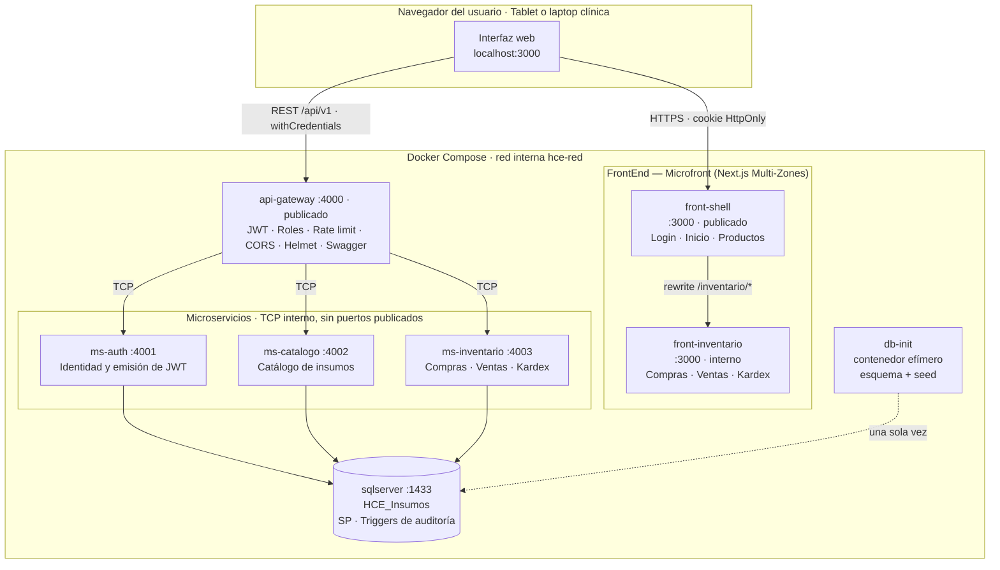
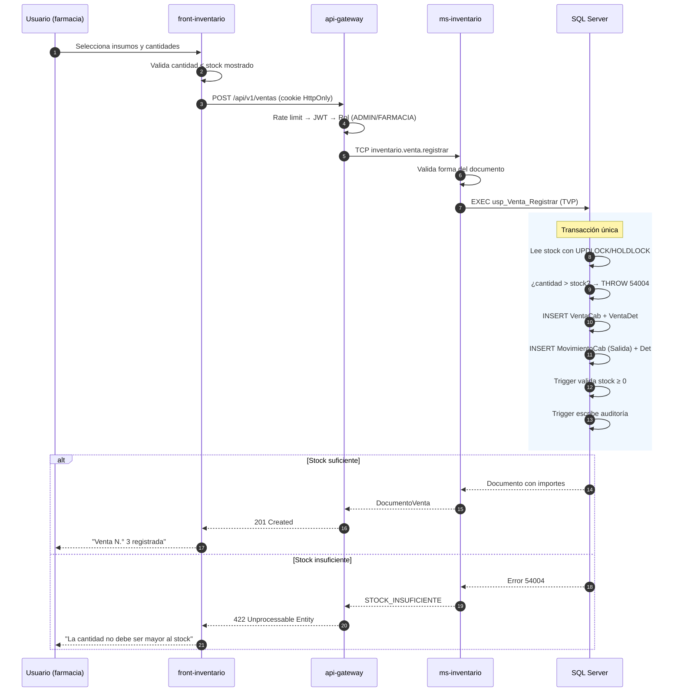
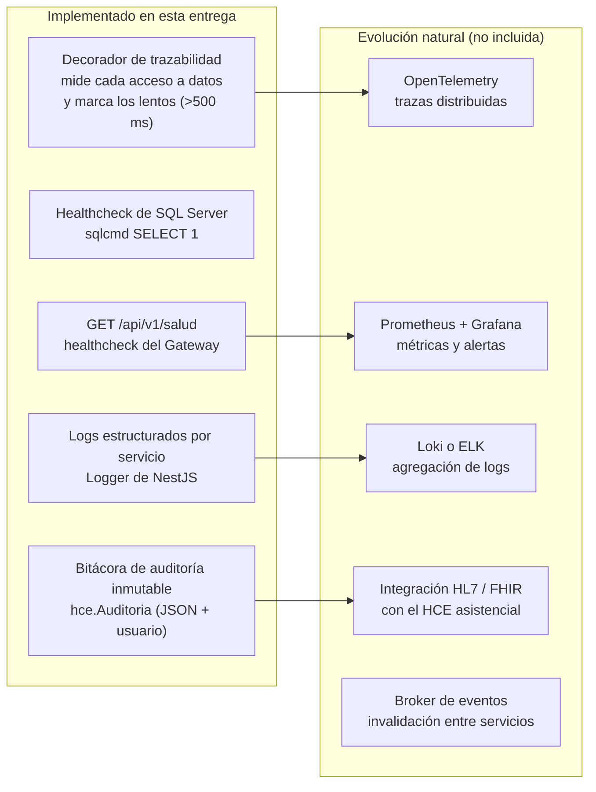
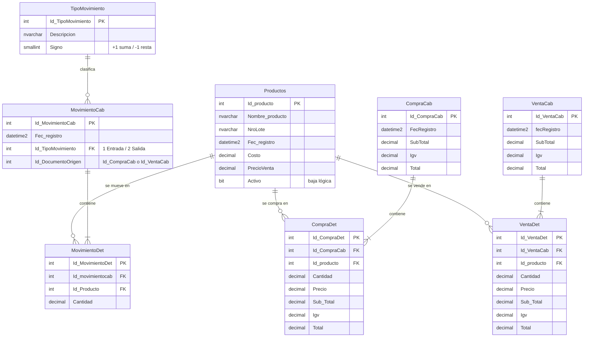

# Arquitectura de la Solución

> Complementa la [evaluación teórica](01-evaluacion-teorica.md) con el diagrama
> del sistema, la justificación de Clean Architecture en entornos de
> salud, los patrones de diseño aplicados y los mecanismos de seguridad.

---

## 1. Diagrama de arquitectura

### 1.1 Vista de despliegue (Docker)



**Puntos clave del despliegue:**

- Solo dos contenedores publican puertos al host: `front-shell` (3000) y
  `api-gateway` (4000). Los tres microservicios y la zona de inventario son
  alcanzables únicamente dentro de la red `hce-red`.
- SQL Server publica 14330 **solo por comodidad de desarrollo** (conectarse con
  SSMS o Azure Data Studio). En un entorno real ese mapeo se elimina.
- `db-init` es un contenedor efímero que aplica esquema, triggers,
  procedimientos y datos de demostración, y termina. Los microservicios esperan
  a que finalice con éxito (`service_completed_successfully`), lo que elimina la
  carrera clásica de "el backend arranca antes que la base".

### 1.2 Flujo de una venta (la operación más crítica)



El bloqueo `UPDLOCK, HOLDLOCK` es lo que impide la **sobreventa por condición
de carrera**: si dos cajas venden el mismo insumo simultáneamente, la segunda
espera a que la primera confirme y vuelve a evaluar el stock real.

### 1.3 Monitoreo e integraciones



**Qué está implementado y qué no**, sin ambigüedad:

| Capacidad                                 | Estado              | Dónde                                               |
| ----------------------------------------- | ------------------- | --------------------------------------------------- |
| Healthcheck HTTP del Gateway              | Implementado        | `GET /api/v1/salud`                                 |
| Healthcheck de la base                    | Implementado        | `docker-compose.yml`                                |
| Logs por servicio con contexto            | Implementado        | `Logger` de NestJS en cada capa                     |
| Medición de latencia de acceso a datos    | Implementado        | Decoradores `*PasarelaTrazada`                      |
| Detección de consulta lenta               | Implementado        | Umbral configurable (500 ms lectura, 1 s escritura) |
| Auditoría de cambios con usuario          | Implementado        | Triggers DML → `hce.Auditoria`                      |
| Correlación de peticiones entre servicios | Implementado        | `X-Request-Id` propagado por RPC                    |
| Latencia de cada petición HTTP            | Implementado        | Registro de acceso en el Gateway                    |
| Métricas agregadas y alertas              | **No implementado** | Requiere Prometheus + Grafana                       |
| Integración HL7/FHIR con el HCE           | **No implementado** | Fuera del alcance del enunciado                     |

La integración con un HCE asistencial real se haría por **HL7 v2 o FHIR**,
mapeando el despacho de insumos a un recurso `MedicationDispense` vinculado al
`Encounter` de la atención. El modelo de datos actual ya lo soporta: la tabla
`MovimientoCab` guarda el documento de origen, que sería el punto de anclaje.

---

## 2. Clean Architecture: justificación en sistemas de salud

> Apartado exigido explícitamente por la sección 1.3 del enunciado.

### 2.1 La estructura

Cada microservicio se organiza en las **cuatro capas de Clean Architecture**, con
dependencias que apuntan **siempre hacia adentro**:

```
        ┌─────────────────────────────────────────────────────┐
        │  4 · INFRAESTRUCTURA                                │
        │     NestJS · main.ts · módulos · driver mssql       │
        │  ┌───────────────────────────────────────────────┐  │
        │  │  3 · ADAPTADORES DE INTERFAZ                  │  │
        │  │     Controladores · Pasarelas · Mapeadores    │  │
        │  │  ┌─────────────────────────────────────────┐  │  │
        │  │  │  2 · APLICACIÓN                         │  │  │
        │  │  │     Casos de uso · Puertos · Modelos    │  │  │
        │  │  │  ┌───────────────────────────────────┐  │  │  │
        │  │  │  │  1 · DOMINIO                      │  │  │  │
        │  │  │  │     Entidades · Objetos de valor  │  │  │  │
        │  │  │  └───────────────────────────────────┘  │  │  │
        │  │  └─────────────────────────────────────────┘  │  │
        │  └───────────────────────────────────────────────┘  │
        └─────────────────────────────────────────────────────┘
```

```
apps/ms-inventario/src/
├── dominio/                              Capa 1 · Reglas de negocio de empresa
│   └── entidades/inventario.entidades.ts    Invariantes del agregado
├── aplicacion/                           Capa 2 · Reglas de negocio de aplicación
│   ├── puertos/entrada/                     Fronteras de entrada (Input Boundary)
│   ├── puertos/salida/                      Fronteras de salida (Output Boundary)
│   ├── modelos/                             Peticiones y respuestas planas
│   ├── casos-uso/                           8 archivos, una clase cada uno
│   └── fachadas/                            Patrón Facade
├── adaptadores/                          Capa 3 · Adaptadores de interfaz
│   ├── controladores/                       Transporte TCP
│   ├── pasarelas/                           Gateways a SQL Server + Decorator
│   └── mapeadores/                          Fila de BD → modelo de aplicación
└── infraestructura/                      Capa 4 · Frameworks y drivers
    ├── nestjs/inventario.module.ts          Raíz de composición
    └── main.ts                              Arranque del proceso
```

### 2.2 La regla de dependencia está verificada, no solo escrita

Esto es lo que separa "Clean Architecture de nombre" de Clean Architecture real.

Dos invariantes se comprueban automáticamente en cada ejecución de la suite:

1. **Ninguna capa importa de una capa más externa.**
2. **El dominio y la aplicación no importan NINGÚN framework**: ni `@nestjs/*`,
   ni `mssql`, ni `express`, ni `bcryptjs`, ni `class-validator`.

```bash
npm test -- regla-dependencia
```

La prueba [`test/regla-dependencia.spec.ts`](../backend/test/regla-dependencia.spec.ts)
recorre el código fuente, analiza cada `import` y falla señalando el archivo y la
línea exactos. Si falla, no se rompió una convención de estilo: se rompió la
arquitectura.

La consecuencia práctica de esa segunda regla es que **los casos de uso son
clases planas de TypeScript, sin `@Injectable()`**. Se instancian con
`useFactory` en la raíz de composición:

```typescript
// infraestructura/nestjs/inventario.module.ts
{
  provide: REGISTRAR_VENTA_PUERTO,
  inject: [INVENTARIO_REPOSITORIO],
  useFactory: (r: InventarioRepositorio): RegistrarVentaPuerto =>
    new RegistrarVentaCasoUso(r, new RegistroNest('RegistrarVenta')),
}
```

Poner `@Injectable()` sobre un caso de uso lo ataría al contenedor de NestJS y ya
no podría instanciarse sin él. La verbosidad del módulo es el precio; a cambio,
todo el grafo de dependencias del servicio —incluida la composición de
decoradores— se lee en un solo archivo.

El detalle completo está en [`backend/ARQUITECTURA.md`](../backend/ARQUITECTURA.md).

### 2.3 Por qué importa específicamente en salud

Cuatro razones que no son genéricas:

**1. Las reglas clínicas sobreviven a la tecnología.**
La regla "no se puede despachar más de lo que hay en stock" seguirá siendo
verdad dentro de quince años. El ORM, el framework y el motor de base de datos
no. Aislar la regla del andamiaje técnico evita que una migración de
infraestructura obligue a reescribir —y revalidar— la lógica asistencial.

**2. La trazabilidad y la auditoría son requisitos regulatorios.**
En Perú, DIGEMID exige trazabilidad de medicamentos. Con el dominio aislado, la
regla auditable está en un archivo que un auditor puede leer sin entender
NestJS. La lógica de negocio es _legible como documento_, no solo como código.

**3. La validación de software sanitario es cara.**
Cuando un sistema clínico se somete a validación, revalidar es costoso. La
separación en capas delimita qué cambió: una modificación en una pasarela de
persistencia no toca el dominio validado y acota el alcance de la revalidación.

**4. Se puede probar la regla clínica sin infraestructura.**
Las reglas de importes, márgenes y validación de stock se prueban con objetos
en memoria, sin levantar SQL Server. Eso hace viable ejecutar la suite completa
en cada commit, que es la única forma realista de sostener seguridad clínica en
el tiempo.

### 2.4 El precio que se paga

Ser honesto sobre el coste es parte de la justificación: Clean Architecture
**añade archivos e indirección**. Un CRUD que serían 40 líneas en un controlador
aquí son seis archivos repartidos en cuatro capas, más el cableado explícito en
la raíz de composición.

El intercambio se justifica cuando el dominio tiene reglas reales que proteger.
En este sistema las tiene: derivación de precio, validación de stock con
concurrencia, trazabilidad de movimientos. Para un módulo puramente CRUD sin
invariantes, esta arquitectura sería sobreingeniería.

---

## 3. Patrones de diseño aplicados

> Exigidos por el enunciado: **Facade** y **Decorator**.

### 3.1 Facade

**Dónde:** `AutenticacionFachada`, `CatalogoFachada`, `InventarioFachada`.

**Qué resuelve:** el subsistema de inventario tiene ocho casos de uso repartidos
en tres familias. Sin la fachada, el controlador dependería de ocho clases y
conocería la estructura interna del subsistema.

```typescript
// El controlador depende de UNA clase, no de ocho
@Controller()
export class InventarioControlador {
  constructor(private readonly fachada: InventarioFachada) {}

  @MessagePattern(PATRONES_INVENTARIO.REGISTRAR_VENTA)
  registrarVenta(@Payload() payload) {
    return this.fachada.registrarVenta(payload.lineas, payload.usuarioApp);
  }
}
```

**Beneficio concreto:** agregar "anular venta" es añadir un caso de uso y un
método a la fachada. El controlador no cambia.

**Regla que se respetó:** la fachada **no contiene lógica de negocio**, solo
orquesta. Cualquier `if` de negocio que aparezca ahí indica que falta un caso de
uso.

### 3.2 Decorator

**Dónde:** `UsuarioPasarelaTrazada`, `ProductoPasarelaTrazada`,
`ProductoPasarelaConReintentos`, `InventarioPasarelaTrazada`
(capa 3, en `adaptadores/pasarelas/`).

Los decoradores implementan la misma interfaz que envuelven, reciben el
componente por constructor y son apilables:

```typescript
{
  provide: PRODUCTO_REPOSITORIO,
  inject: [MssqlService],
  useFactory: (mssql: MssqlService) =>
    new ProductoPasarelaTrazada(             // añade trazabilidad
      new ProductoRepositorioConReintentos(  // añade tolerancia a fallos
        new ProductoMssqlRepositorio(mssql), // acceso real a datos
      ),
    ),
}
```

**El orden importa y está razonado:** el trazado envuelve a los reintentos, de
modo que el tiempo registrado es el que percibe el caso de uso, incluidas las
esperas entre intentos. Invertirlo mediría un solo intento y ocultaría la
latencia real ante un fallo transitorio.

**Decisión de diseño en el decorador de reintentos:** solo reintenta lecturas.
Las escrituras no se reintentan porque, si la conexión se corta después del
`COMMIT` pero antes de la confirmación, reintentar duplicaría la operación. Eso
requeriría una clave de idempotencia que el contrato actual no define.

### 3.3 Otros patrones presentes

| Patrón               | Dónde                                          | Para qué                                             |
| -------------------- | ---------------------------------------------- | ---------------------------------------------------- |
| Repository           | `ProductoRepositorio`, `InventarioRepositorio` | Abstraer la persistencia del dominio                 |
| Adapter              | `ProductoMssqlRepositorio`, `BcryptServicio`   | Implementar los puertos contra tecnología concreta   |
| Dependency Injection | Tokens `Symbol` + `useFactory`                 | Invertir dependencias (la D de SOLID)                |
| Value Object         | `Importe`                                      | Encapsular el cálculo de importes de forma inmutable |
| API Gateway          | `api-gateway`                                  | Punto único de entrada y seguridad                   |
| Multi-Zones          | `front-shell` + `front-inventario`             | Microfrontend con despliegue independiente           |

---

## 4. Principios SOLID

| Principio                         | Aplicación verificable                                                                                                                             |
| --------------------------------- | -------------------------------------------------------------------------------------------------------------------------------------------------- |
| **S** — Responsabilidad única     | Cada caso de uso resuelve una operación. `MssqlService` solo gestiona el pool y ejecuta procedimientos: no conoce entidades                        |
| **O** — Abierto/cerrado           | Añadir trazabilidad o reintentos no modificó el repositorio: se envolvió con decoradores                                                           |
| **L** — Sustitución de Liskov     | Todo decorador es intercambiable por el repositorio que envuelve; el caso de uso no distingue                                                      |
| **I** — Segregación de interfaces | `InventarioRepositorio` se declara como tres interfaces (`Compra`, `Venta`, `Kardex`): un caso de uso de Kardex no depende de métodos de escritura |
| **D** — Inversión de dependencias | Los casos de uso dependen de interfaces del dominio; las implementaciones se inyectan por token                                                    |

---

## 5. Seguridad

> El enunciado exige **mínimo 2** mecanismos. Se implementaron **6**.

### 5.1 Mecanismos implementados

| #   | Mecanismo                  | Implementación                                                                                         | Verificado por    |
| --- | -------------------------- | ------------------------------------------------------------------------------------------------------ | ----------------- |
| 1   | **JWT de 30 minutos**      | HS256, `expiresIn: 1800`, con `issuer` y `audience` validados                                          | Prueba de humo 3  |
| 2   | **Cookie HttpOnly**        | `httpOnly`, `sameSite: lax`, `secure` en producción. El token nunca se guarda en `localStorage`        | Prueba de humo 3  |
| 3   | **Rate limiting**          | Dos políticas: 100/min general, 5/min en login                                                         | Prueba de humo 15 |
| 4   | **CORS restringido**       | Lista blanca de orígenes; el comodín `*` se rechaza al arrancar                                        | Prueba de humo 18 |
| 5   | **Cabeceras de seguridad** | Helmet + `X-Content-Type-Options: nosniff` explícito, `X-Frame-Options: DENY`, CSP, sin `X-Powered-By` | Prueba de humo 17 |
| 6   | **Autorización por rol**   | Guard global; `ADMIN`, `FARMACIA`, `CONSULTA`                                                          | Prueba de humo 13 |

### 5.2 Otras defensas aplicadas

- **Contraseñas con bcrypt** (coste 10). Nunca se almacenan en claro.
- **Defensa contra enumeración por temporización**: el login verifica el hash
  incluso cuando el usuario no existe, contra un hash señuelo de coste
  equivalente. Sin esto, el tiempo de respuesta revelaría qué usuarios existen.
- **Prevención de inyección SQL por construcción**: toda entrada viaja como
  parámetro tipado del driver `mssql`; nunca se concatena SQL. Los detalles de
  compra y venta usan Table-Valued Parameters.
- **Anti _mass assignment_**: `ValidationPipe` con `forbidNonWhitelisted: true`
  rechaza cualquier campo no declarado en el DTO.
- **El precio de venta nunca se acepta del cliente**: se toma del catálogo en el
  servidor. Aceptarlo permitiría despachar medicamentos a importe manipulado.
- **Errores de infraestructura no se filtran**: el detalle del motor se registra
  en el servidor y al cliente se le devuelve un mensaje genérico.
- **Contenedores sin privilegios**: las imágenes ejecutan como usuario `node`.
- **Bitácora de auditoría inmutable**: un trigger `INSTEAD OF UPDATE, DELETE`
  rechaza cualquier modificación de `hce.Auditoria`.

### 5.3 Un hallazgo real durante el desarrollo

La primera versión del microservicio de catálogo incluía un decorador de
**caché** sobre las lecturas de producto. La prueba de humo end-to-end lo
detectó como fallo: tras vender 10 unidades, el catálogo seguía informando el
stock anterior.

**Causa:** la proyección de producto incluye `stockActual`, pero quien modifica
el stock es `ms-inventario`. El microservicio de catálogo no se entera de esas
escrituras, así que su caché no puede invalidarse y sirve existencias obsoletas.

**Decisión:** se eliminó el caché y se sustituyó por un decorador de reintentos.
Cachear stock solo sería correcto con invalidación entre servicios (eventos de
dominio sobre un broker, o caché compartida en Redis con invalidación publicada
por inventario). Mientras eso no exista, **la lectura barata no compensa el
riesgo clínico** de que un operador confíe en una existencia que ya no está.

El razonamiento queda documentado en el propio código, en
[`producto.repositorio-decoradores.ts`](../backend/apps/ms-catalogo/src/adaptadores/pasarelas/producto.pasarela-decoradores.ts).

### 5.4 Limitaciones conocidas

Declararlas es parte de la entrega:

- **Sin refresh token.** Al expirar los 30 minutos el usuario vuelve a
  autenticarse. Es aceptable en un entorno clínico de turno, pero un sistema en
  producción incorporaría rotación de tokens.
- **Sin revocación de tokens.** Un JWT emitido es válido hasta que expira.
  Mitigado parcialmente porque `/auth/perfil` consulta la base y detecta cuentas
  desactivadas.
- **Sin HTTPS en el compose local.** `COOKIE_SEGURA=false` para desarrollo. En
  producción es obligatorio `true` detrás de un terminador TLS.
- **`trustServerCertificate: true`** contra el SQL Server del contenedor, que usa
  certificado autofirmado. En producción se usa el certificado corporativo.
- **El middleware del FrontEnd no verifica la firma del JWT**, solo la presencia
  de la cookie. Es deliberado: verificarla obligaría a distribuir `JWT_SECRET` al
  contenedor del FrontEnd. La autoridad real es el Gateway.

---

## 6. Modelo de datos



### Decisiones de modelado

**El stock no se almacena.** No existe una columna `stock` en `Productos`: se
deriva siempre de `MovimientoDet` a través de la vista `vw_StockActual`. Guardar
un contador implicaría dos fuentes de verdad que pueden desincronizarse, y en
trazabilidad farmacéutica la existencia debe ser auditable movimiento a
movimiento.

**`TipoMovimiento` es una tabla, no una constante.** Con la columna `Signo`, el
cálculo del stock es una única suma. Añadir ajustes de inventario, mermas o
devoluciones es insertar una fila, no modificar el esquema ni las consultas.

**Baja lógica en productos.** Un producto referenciado por movimientos
históricos nunca debe desaparecer físicamente, por trazabilidad sanitaria.

**Restricción única en `MovimientoCab (Id_TipoMovimiento, Id_DocumentoOrigen)`.**
Impide que un mismo documento genere dos veces el mismo movimiento, lo que
duplicaría stock ante un reintento del cliente.

---

## 7. Estructura del repositorio

```
examen-hce-clinica-san-felipe/
├── docker-compose.yml            Levanta todo el ecosistema
├── .env.example                  Plantilla de configuración
│
├── database/                     SQL Server
│   ├── 01-schema.sql             Tablas, índices, vistas
│   ├── 02-triggers-auditoria.sql Auditoría e integridad
│   ├── 03-stored-procedures.sql  TVPs, funciones y los 8 servicios
│   ├── 04-consultas-tsql.sql     CRUD de referencia por entidad
│   ├── 05-seed.sql               Usuarios, catálogo, compras y venta
│   ├── 06-seguridad-accesos.sql  Una cuenta por microservicio, mínimo privilegio
│   ├── 99-pruebas-verificacion.sql  13 pruebas: negocio y aislamiento
│   └── init/run-init.sh          Inicialización dentro de Docker
│
├── backend/                      Monorepo NestJS · Clean Architecture
│   ├── ARQUITECTURA.md           Guía de capas: qué va dónde y por qué
│   ├── test/                     Prueba de la regla de dependencia
│   ├── apps/
│   │   ├── api-gateway/          HTTP, seguridad, Swagger
│   │   ├── ms-auth/              Identidad y JWT
│   │   ├── ms-catalogo/          Productos
│   │   └── ms-inventario/        Compras, ventas, Kardex
│   └── libs/compartido/          Dominio · aplicación · adaptadores · infra
│
├── frontend/                     Microfront (Next.js Multi-Zones)
│   ├── apps/shell/               Zona anfitriona · única expuesta
│   │   └── src/
│   │       ├── app/              Rutas: solo composición
│   │       ├── funcionalidades/  productos/
│   │       └── compartido/       api · navegación
│   ├── apps/inventario/          Zona de inventario · basePath /inventario
│   │   └── src/
│   │       ├── app/              Rutas: solo composición
│   │       ├── funcionalidades/  compras/ · ventas/ · kardex/
│   │       └── compartido/       api · useCatalogo · useLineasDocumento
│   └── paquetes/                 Lo que comparten AMBAS zonas
│       ├── api-cliente/          Axios + interceptores + tipos
│       └── ui/                   Sistema de diseño y chrome
│
├── postman/                      Colección de pruebas de la API
├── scripts/prueba-humo.sh        43 verificaciones end-to-end
└── docs/                         Esta documentación
```

### Dónde va cada cosa en el FrontEnd

Hay dos ejes, y conviene no confundirlos:

| Eje               | Qué decide                  | Cómo se materializa                          |
| ----------------- | --------------------------- | -------------------------------------------- |
| **Microfront**    | Fronteras de **despliegue** | `apps/*` — cada zona es un contenedor propio |
| **Feature-based** | Fronteras de **código**     | `funcionalidades/*` dentro de cada zona      |

De ahí sale una regla que resuelve casi todas las dudas de ubicación:

- Lo que usan **varias funcionalidades de una misma zona** → `compartido/` de esa
  zona. Es el caso de `useCatalogo` y `useLineasDocumento`, que sirven a compras
  y a ventas pero no significan nada para la shell.
- Lo que usan **ambas zonas** → `paquetes/`. Es una dependencia de workspace
  declarada, que es la forma legítima de compartir en un microfront.
- Lo que usa **una sola funcionalidad** → dentro de su carpeta. `ModalNuevoProducto`
  vive en `funcionalidades/compras/` porque solo compras lo abre.

Subir a `paquetes/` algo que solo necesita una zona rompería el aislamiento: la
shell heredaría conceptos de inventario y dejarían de poder evolucionar por
separado. Ese es el error que la regla evita.

Las rutas de `app/` quedan reducidas a una línea de composición. El App Router
exige un archivo por ruta, pero la pantalla vive en su funcionalidad: así todo lo
de compras —estado, tabla, modal— está en una carpeta, y un cambio no obliga a
recorrer el árbol entero.

> **Lo que feature-based no hace por sí solo:** eliminar duplicación. Lo que hace
> es volverla visible, porque obliga a decidir dónde vive cada cosa. Si algo
> sirve a compras y a ventas, no cabe en ninguna de las dos carpetas — y esa
> incomodidad es la señal de que debe subir. Fue exactamente así como salieron
> `useCatalogo`, `useLineasDocumento` y `FormularioProducto`.
